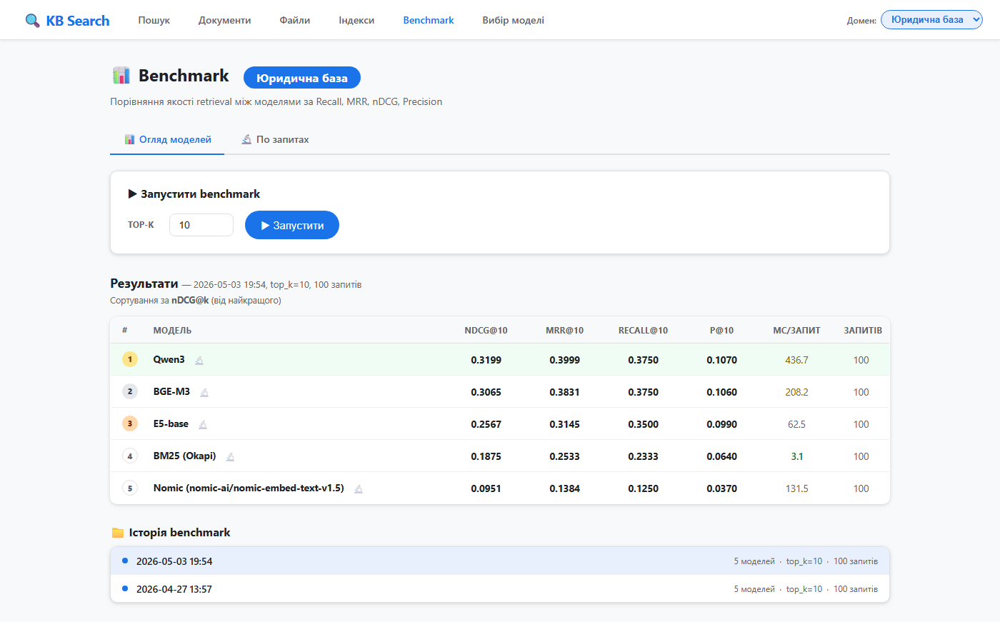

# Demo Video Script — захист магістерської

> Покроковий сценарій запису демо-відео.
> **Сюжет:** «у мене 5 моделей — як вибрати? Ось як це робить мій застосунок».
> Селекція — герой демонстрації; пошук — підтвердження вибору; explorer — кількісні докази.
> **Тривалість:** ~5–6 хв при темпі 2.3 слова/сек.
> Разом зі слайдами (~9 хв) вкладаємось у 15-хвилинне вікно з запасом ~1 хв.
>
> **Як працювати з цим файлом:** у голосовому блоці кожної секції читай зверху донизу як єдину промову.

---

## ⚙ Перед записом — підготовка

1. Закрий усі вкладки браузера, залиш одну.
2. F11 — повний екран.
3. Запусти застосунок: `.venv/Scripts/python.exe src/app.py`. Чекай рядка `Running on http://127.0.0.1:5000`.
4. Відкрий `http://127.0.0.1:5000/` — переконайся, що сторінка завантажилась.
5. **Прогрій моделі**: зроби 1 dummy-пошук на tech/BGE-M3 (наприклад «тест»). Перший виклик повільний — кешуй заздалегідь.
6. Розширення браузера, що показують оверлеї (переклади/блокувачі), вимкни тимчасово.
7. Записувач: OBS / GameBar (Win+G) / Loom. Розрішення **1920×1080**.
8. Перед записом — одна тренувальна прогонка БЕЗ запису.
9. Можна записувати посекційно і клеїти у відеоредакторі. Простіше, ніж дублем.

---

## 📋 Загальна карта (9 секцій ≈ 6 хв)

| # | Що показуємо | URL / дія | Сек |
|---|---|---|---|
| 1 | Hero | `/` | 30 |
| 2 | `/benchmark` Tech | Tab «Benchmark» | 52 |
| 3 | `/benchmark/selection` Tech | Tab «Вибір моделі» | 63 |
| 4 | **Тягнеш Latency повзунок → рек. → E5-base** | drag слайдер | 65 |
| 5 | `/benchmark` для Legal | дропдаун домену | 28 |
| 6 | `/` Tech BGE-M3 + churn-запит | Tab «Пошук», ввести | 35 |
| 7 | Той самий запит, **BM25** | клік плашки моделі | 35 |
| 8 | `/benchmark/explorer/q6` | URL або кліком | 41 |
| 9 | Closing | — | 16 |
| | **РАЗОМ** | | **~6:00** |

---

## 🎬 СЦЕНАРІЙ ПО СЕКЦІЯХ

### Section 1 — Hero (~30 с)

**Дія:** відкрий `http://127.0.0.1:5000/`. Курсор біля поля пошуку.


**Голос:**

> Перед вами Flask-застосунок, який я розробив у рамках кваліфікаційної роботи. Він автоматизує весь pipeline — від завантаження документів і побудови індексів до оцінки якості та вибору моделі. Зверху — навігація: пошук, документи, файли, побудова індексів, бенчмарк, вибір моделі. Праворуч — перемикач трьох доменів: технічного, юридичного, медичного. Покажу, як цей застосунок вирішує головне практичне питання роботи — **обґрунтований вибір embedding-моделі для конкретної корпоративної бази знань**.

---

### Section 2 — `/benchmark` Tech (~52 с)

**Дія:** Tab «Benchmark» зверху. Домен — Технічний.


**Голос:**

> Сторінка бенчмарку. Тут результати, обчислені за стандартними метриками інформаційного пошуку — nDCG, MRR, Recall, Precision — плюс латентність у мілісекундах на запит. На технічному домені виміряно 5 моделей по 100 запитах. Лідер за nDCG — **BGE-M3 з 0.6722**. Друга — Qwen3 з 0.6325. Далі E5-base, BM25 і nomic. Зверніть увагу: BM25, попри лексичну природу, переважає семантичну nomic — це показує, що сильна baseline залишається конкурентною, особливо за дуже жорстких вимог до швидкості. Але «лідер за однією метрикою» не дорівнює «найкращий вибір» — треба враховувати і швидкодію, і вимоги до ресурсів. Саме для цього зроблено окрему сторінку — вибір моделі.

---

### Section 3 — `/benchmark/selection` Tech (~63 с) — герой демо

**Дія:** Tab «Вибір моделі» (це `/benchmark/selection`). Домен — Технічний.


**Голос:**

> Це сторінка багатокритеріального вибору моделі — реалізація методології з третього розділу роботи. Зверху — рекомендована модель: **BGE-M3, інтегральний score 0.9040**, позначена як Парето-оптимальна. «Парето-оптимальна» означає, що жодна інша модель не перевершує її одночасно за всіма критеріями — тобто це раціональний кандидат, а не явно гірший варіант. Нижче — Парето-множина для tech-домену: **BGE-M3, E5-base і BM25**. Це три моделі, які можна рекомендувати залежно від пріоритетів користувача; решта — Qwen3 і nomic — домінуються. Ще нижче — поточний профіль ваг: nDCG — 0.30, MRR — 0.20, Recall — 0.25, Precision — 0.05, latency — 0.20. Профілі підібрано емпірично для типових сценаріїв пошуку в кожному домені — їх обґрунтування описано у четвертому розділі. Score обчислюється як зважена сума нормалізованих метрик і відображається в окремій колонці таблиці нижче.

---

### Section 4 — слайдер Latency → інша рекомендація (~65 с) — wow-момент

**Дія:**
- Береш повзунок **Latency** і тягнеш праворуч приблизно до **0.50**.
- Паралельно: трохи зменши nDCG до ~0.15 і MRR до ~0.10 — щоб сума ваг залишалась 1.0.
- Після ~0.5 с (debounce) рекомендація вгорі перерахується.


**Голос:**

> А тепер уявімо, що для вашого сценарію критична швидкість відповіді — наприклад, real-time чат-бот техпідтримки, де користувач не чекатиме 200 мілісекунд на відповідь. Збільшую вагу latency з 0.20 до 0.50, відповідно зменшую ваги nDCG і MRR — застосунок перераховує. Рекомендація **змінюється на E5-base** зі score 0.8450. Профіль автоматично переключився на «Користувацький». BGE-M3 опускається на третє місце — нагадаю, вона у три рази повільніша за E5: 228 мілісекунд проти 70. Що принципово важливо: і E5-base, і BGE-M3 залишаються в Парето-множині, тобто обидві — раціональні варіанти. Який саме обрати — визначається конкретними вагами критеріїв. Застосунок не нав'язує одне рішення, а дає **інструмент для прийняття обґрунтованого рішення**. Це і є суть багатокритеріального вибору: відповідь не статична, а керується вашими пріоритетами.

---

### Section 5 — `/benchmark` для Legal (~28 с)

**Дія:** Tab «Benchmark» зверху. Перемикай домен на **«Юридична база»**.



**Голос:**

> Інший домен — юриспруденція. Те саме порівняння. За сирим nDCG лідером стає **Qwen3 з 0.3199**, BGE-M3 — другий з 0.3065. Усі моделі тут показують нижчі значення — юридичні тексти об'єктивно складніші для семантичного пошуку через формальний стиль і вузькоспеціалізовану термінологію. Це підкреслює: **немає універсального переможця** — оптимальна модель залежить і від типу корпусу, і від пріоритетів користувача.

---

### Section 6 — `/` пошук Tech BGE-M3 + churn (~35 с)

**Дія:**
- Tab «Пошук». Перемкни домен назад на **«Техніка / IT»**. Модель — BGE-M3.
- У поле пошуку встав запит (копіпаст із блоку нижче) і натисни «Шукати».

**Запит для копіпасту:**

```
прогноз відтоку клієнтів (churn prediction)
```


**Голос:**

> Підтвердження вибору в дії. Технічний пошук, обрана модель — BGE-M3. Запит — змішаний українсько-англійський: «прогноз відтоку клієнтів — у дужках churn prediction». Це реальний сценарій корпоративної бази, де користувачі вільно змішують терміни різними мовами. Модель знаходить релевантний фрагмент із магістерської роботи Потапенка — там про класифікацію клієнтів на групи «відтік» і «утримання». **Зверніть увагу — жодного явного збігу слів між запитом і знайденим фрагментом немає.** Модель оперує сенсом, а не літерами.

---

### Section 7 — BM25 на тому самому запиті (~35 с)

**Дія:** клікни плашку моделі **BM25** під полем пошуку. Запит залишиться той самий.


**Голос:**

> Для контрасту перемикаю на BM25 — лексичну baseline. Той самий запит. BM25 знаходить **ту саму** роботу, але повертає менш корисний фрагмент: англомовний абстракт і список літератури. Чому так? BM25 ранжує за частотою слів — «churn», «prediction», «client», «management». Сторінки з абстрактом мають високу концентрацію цих термінів. А BGE-M3 ранжує за змістом — за тематичною відповідністю. Це і є відмінність семантичного пошуку від лексичного — на цьому ж запиті.

---

### Section 8 — `/benchmark/explorer/q6` (~41 с)

**Дія:** в адресному рядку: `http://127.0.0.1:5000/benchmark/explorer/q6?domain=tech`.
(Або: Tab «Benchmark» → вкладка «По запитах» → q6.)


**Голос:**

> Сторінка детального аналізу per-query — той самий churn-запит, але тут кількісна картина. У таблиці зверху — порівняння всіх моделей по чотирьох метриках. BGE-M3, Qwen3, E5-base і nomic мають **nDCG 1.0** — тобто релевантний документ на першій позиції. BM25 — лише 0.356, релевантний документ десь у середині списку. Нижче — топ-K результатів кожної моделі з підсвічуванням саме тих чанків, які експерти позначили як релевантні в qrels. Це інструмент для дебагу — коли потрібно зрозуміти, чому конкретна модель промахується на конкретному запиті. Це per-query картина, що стоїть за агрегованими метриками з бенчмарку.

---

### Closing (~16 с)

**Голос:**

> Це підтверджує всі ключові висновки роботи: семантичний пошук статистично значуще переважає лексичний; оптимальна модель залежить і від домену, і від пріоритетів; розроблений застосунок дає інструмент для обґрунтованого вибору. Дякую за увагу — готовий відповісти на запитання.

---

## 🛟 Якщо щось піде не так під час запису

| Симптом | Що робити |
|---|---|
| Перший пошук довго думає | Прогрій моделі ще ДО запису — крок 5 у підготовці. |
| Слайдер latency не переміщується мишею | Клікни на трек повзунка біля бажаного положення — він стрибне туди. |
| Рекомендація не змінюється після слайдеру | Debounce 450 мс. Зачекай 1 секунду перед коментарем. |
| Сторінка `/benchmark` порожня | Запусти `python scripts/run_all_benchmarks.py` (5-10 хв). |
| Браузер показує переклад/попап | Тимчасово вимкни розширення. |
| Загубив місце у скрипті | Кожна секція самостійна — можна записати окремо і склеїти. |

---

## ⏱ Тайминг бюджету

Демо-відео — кількість слів і реальний час при читанні зі звичайною академічною швидкістю 2.3 слова/сек:

| Секція | Слова | Сек |
|---|---|---|
| 1. Hero | 68 | 30 |
| 2. Benchmark Tech | 120 | 52 |
| 3. Selection Tech | 145 | 63 |
| 4. Latency slider | 150 | 65 |
| 5. Benchmark Legal | 65 | 28 |
| 6. Search BGE churn | 80 | 35 |
| 7. Search BM25 churn | 80 | 35 |
| 8. Explorer q6 | 95 | 41 |
| 9. Closing | 38 | 16 |
| **Сума** | **~841** | **~366 с (≈ 6:00)** |

**Спільний бюджет із слайдами:**
- Слайди: 1221 слово ≈ 9 хв при темпі 2.3 wps
- Демо: ~6 хв
- **Разом ≈ 15 хв** ✓ Вкладаємось у вікно.

Якщо біжиш по часу — найбезболісніше скорочуються секції 5 (Legal benchmark) і 7 (BM25-контраст). Вони підкріплюють основну ідею, але не несуть нових концепцій.

---

## 🔄 Як перезняти скріни

```bash
.venv/Scripts/python.exe src/app.py                          # окремий термінал
.venv/Scripts/python.exe thesis/scripts/capture_demo_screenshots.py
```

Скріни запишуться в `thesis/demo_screenshots/` (перетруть існуючі).

---

## 📂 Стан скрінів (у `thesis/demo_screenshots/`)

| Файл | Призначення |
|---|---|
| `01_hero_tech.png` | головна, чисто |
| `02_tech_bge_churn.png` | BGE-M3 + churn — релевантний фрагмент |
| `03_tech_bm25_churn.png` | BM25 + churn — менш корисний фрагмент |
| `04_medical_bge_antibiotics.png` | (бонус) Medical BGE — антибіотики |
| `05_medical_bm25_antibiotics.png` | (бонус) Medical BM25 — нерелевантне |
| `06_documents_tech.png` | (бонус) корпус документів |
| `07_benchmark_tech.png` | Benchmark Tech, 5 моделей, BGE лідер |
| `08_benchmark_legal.png` | Benchmark Legal, Qwen3 лідер |
| `09_selection_tech.png` | MCDA Tech дефолт |
| `09a_selection_legal.png` | MCDA Legal дефолт |
| `09b_selection_medical.png` | MCDA Medical дефолт |
| `09c_selection_tech_speed_priority.png` | MCDA Tech з latency=0.5 → E5-base |
| `10_explorer_tech.png` | (бонус) explorer index |
| `11_explorer_q6_churn.png` | explorer drill-down по q6 |
