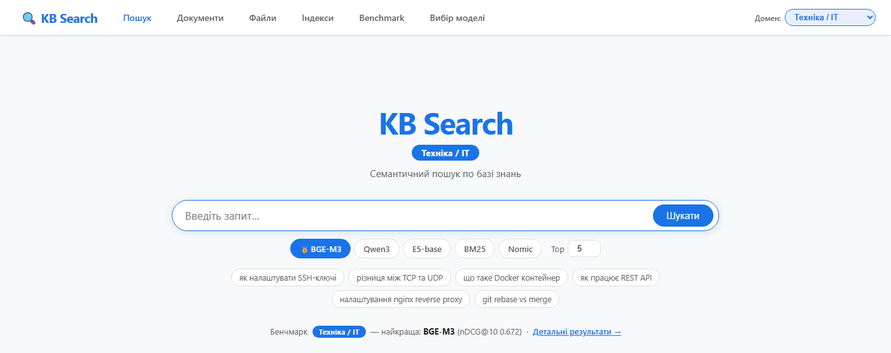
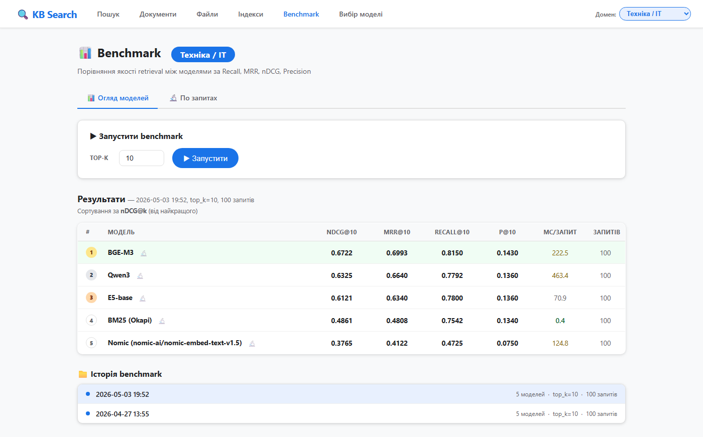
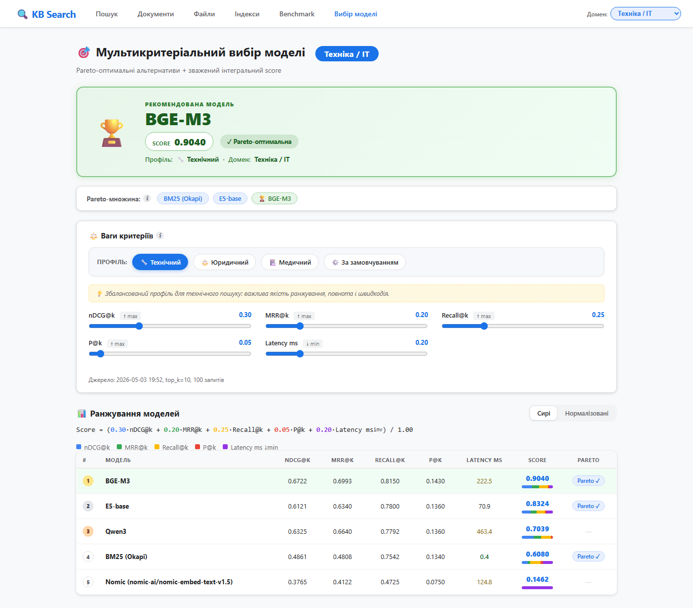
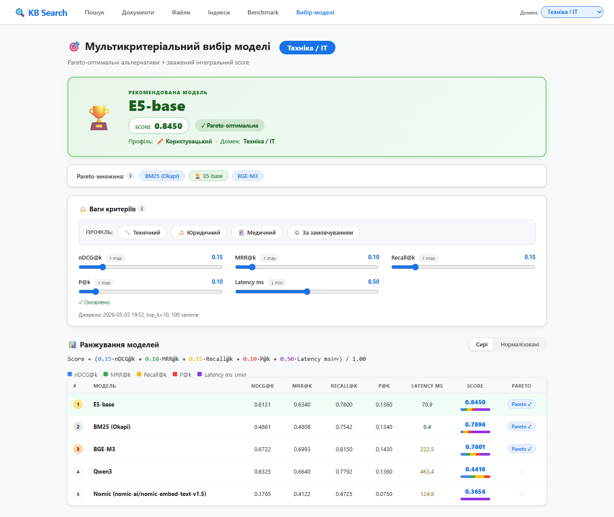
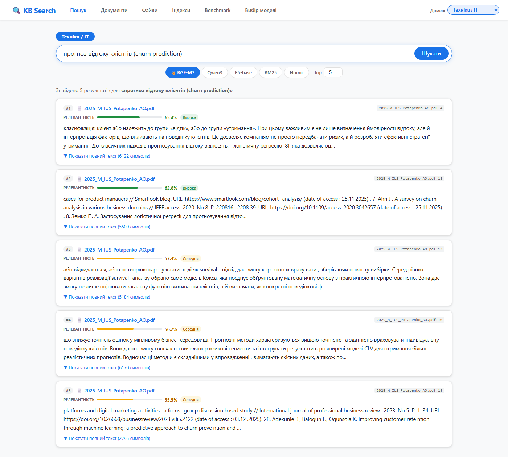
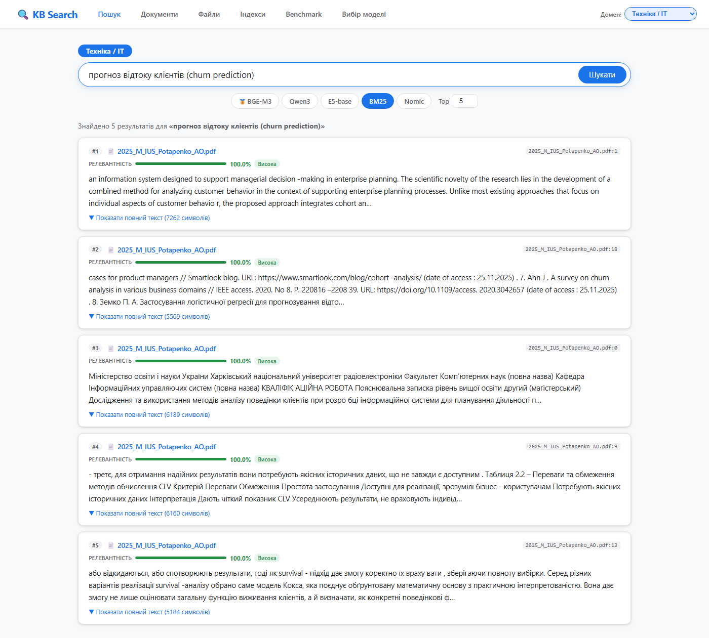
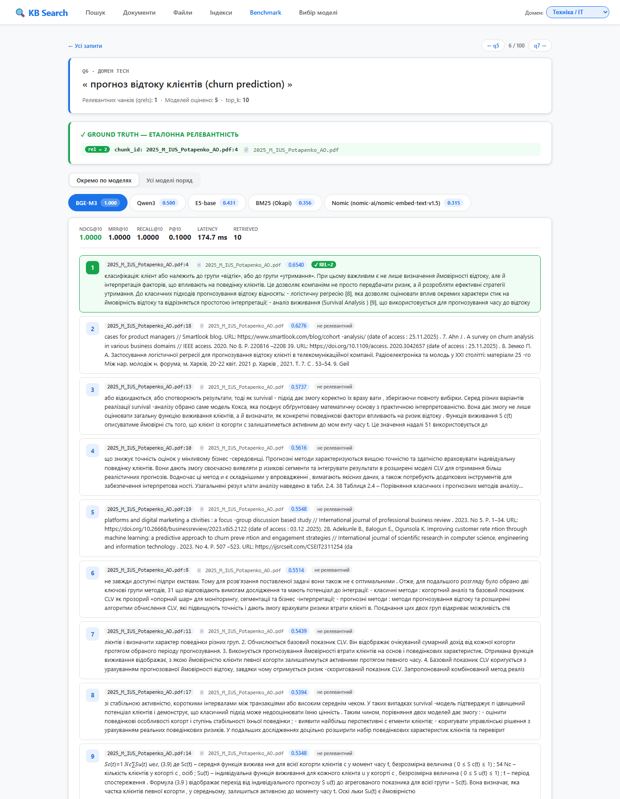

# Сценарій демо-відео — захист магістерської

> Покроковий сценарій запису демо-відео.
> **Сюжет:** «у мене 5 моделей — як вибрати? Ось як це робить мій застосунок».
> Вибір моделі — центральна частина демонстрації; пошук — підтвердження вибору; детальний аналіз — кількісні докази.
> **Тривалість:** ~5:02 при темпі 2.3 слова/сек.
> Разом зі слайдами (~9 хв) вкладаємось у 15-хвилинне вікно з запасом ~1 хв.
>
> **Як працювати з цим файлом:** у голосовому блоці кожної сцени читай зверху донизу як єдину промову.

---

## ⚙ Перед записом — підготовка

1. Закрий усі вкладки браузера, залиш одну.
2. F11 — повний екран.
3. Запусти застосунок: `.venv/Scripts/python.exe src/app.py`. Чекай рядка `Running on http://127.0.0.1:5000`.
4. Відкрий `http://127.0.0.1:5000/` — переконайся, що сторінка завантажилась.
5. **Прогрій моделі**: зроби 1 тестовий пошук на технічному домені з BGE-M3 (наприклад «тест»). Перший виклик повільний — прогрій заздалегідь.
6. Розширення браузера, що показують оверлеї (переклади/блокувачі), вимкни тимчасово.
7. Записувач: OBS / GameBar (Win+G) / Loom. Розрішення **1920×1080**.
8. Перед записом — одна тренувальна прогонка БЕЗ запису.
9. Можна записувати посекційно і клеїти у відеоредакторі. Простіше, ніж дублем.

---

## 📋 Загальна карта (7 сцен ≈ 5:02)

| # | Що показуємо | URL / дія | Сек |
|---|---|---|---|
| 1 | Заставка | `/` | 17 |
| 2 | `/benchmark` техніка | вкладка «Бенчмарк» | 56 |
| 3 | `/benchmark/selection` техніка + профілі по доменах | вкладка «Вибір моделі» | 75 |
| 4 | **Повзунок затримки → рекомендація → E5-base** | перетягнути повзунок | 50 |
| 5 | `/` техніка + BGE-M3 + запит про churn | вкладка «Пошук», ввести | 28 |
| 6 | Той самий запит, **BM25** | клік плашки моделі | 30 |
| 7 | `/benchmark/explorer/q6` + завершення | вкладки «Бенчмарк» → «По запитах» | 46 |
| | **РАЗОМ** | | **~5:02** |

---

&nbsp;

&nbsp;

&nbsp;

---

# 🟢 ПОЧАТОК ЧИТАННЯ 🟢

### Сцена 1/7 · `0:00 – 0:17` · Заставка

**Дія:** відкрий `http://127.0.0.1:5000/`. Курсор біля поля пошуку.

**Голос:**

> Серед п'яти доступних embedding-моделей — **яку обрати для конкретної бази знань?** Покажу логіку відповіді на трьох доменах: технічному, юридичному та медичному.



---

### Сцена 2/7 · `0:17 – 1:13` · `/benchmark` техніка

**Дія:** вкладка «Бенчмарк» зверху. Домен — технічний.

**Голос:**

> Результати порівняння за чотирма метриками якості пошуку: **nDCG** показує, наскільки правильно ранжована видача; **MRR** — як рано з'являється перший релевантний результат; **Recall** — яку частку всіх релевантних документів знайдено; **Precision** — яка частка видачі справді релевантна. П'ятий критерій — латентність, час відповіді в мілісекундах. На технічному домені — 5 моделей, 100 запитів. Лідер за nDCG — **BGE-M3 з 0.6722**. Далі Qwen3 з 0.6325, потім E5-base, BM25 і nomic. BM25, попри суто лексичну природу, переважає семантичну nomic — сильна опорна модель залишається конкурентною. Але «лідер за однією метрикою» — не «найкращий вибір»: треба враховувати швидкодію і ресурси. Тому є окрема сторінка вибору моделі.



---

### Сцена 3/7 · `1:13 – 2:28` · `/benchmark/selection` техніка — центральна частина демо

**Дія:** вкладка «Вибір моделі» (це `/benchmark/selection`). Домен — технічний.

**Голос:**

> Зверху — рекомендована модель: **BGE-M3, інтегральна оцінка 0.9040**, позначена як Парето-оптимальна. «Парето-оптимальна» означає, що жодна інша модель не перевершує її одночасно за всіма критеріями — раціональний кандидат, а не явно гірший варіант. Нижче — Парето-множина для технічного домену: **BGE-M3, E5-base і BM25**. Решта — Qwen3 і nomic — домінуються іншими. Ще нижче — профіль ваг тих самих метрик плюс латентність: nDCG — 0.30, MRR — 0.20, Recall — 0.25, Precision — 0.05, латентність — 0.20. **Це збалансований профіль для технічного пошуку — важлива і якість ранжування (nDCG), і повнота (Recall), і швидкодія (латентність). Для юридичного пошуку профіль інший — пріоритет на MRR і nDCG: критично швидко знайти перший релевантний фрагмент і правильно впорядкувати верхівку видачі. Для медичного — найбільша вага на Recall: краще довша відповідь, ніж пропустити релевантний документ.** Інтегральна оцінка — зважена сума нормалізованих метрик.



---

### Сцена 4/7 · `2:28 – 3:18` · повзунок латентності → інша рекомендація — ключовий момент

**Дія:** виставляєш повзунки на ці значення (сума = 1.00):

| Метрика | Вага |
|---|---|
| **nDCG** ↑ | **0.15** |
| **MRR** ↑ | **0.10** |
| **Recall** ↑ | **0.15** |
| **Precision** ↑ | **0.10** |
| **Латентність** ↓ | **0.50** |

Після ~0.5 с рекомендація вгорі перерахується.

**Голос:**

> Уявімо, що критична швидкість відповіді — наприклад, чат-бот техпідтримки у реальному часі, де користувач не чекатиме 200 мілісекунд. Виставляю вагу латентності на 0.50, ваги якісних метрик відповідно зменшую — застосунок перераховує. Рекомендація **змінюється на E5-base** з інтегральною оцінкою 0.8450. Профіль переключився на «Користувацький». BGE-M3 опускається на третє місце — вона у три рази повільніша за E5: 228 мілісекунд проти 70. Але і E5-base, і BGE-M3 залишаються в Парето-множині — обидві раціональні. Застосунок не нав'язує одне рішення, а дає **інструмент для обґрунтованого вибору під конкретні пріоритети**.



---

### Сцена 5/7 · `3:18 – 3:46` · `/` пошук техніка + BGE-M3 + запит про churn

**Дія:**
- Вкладка «Пошук». Перемкни домен назад на **«Техніка / IT»**. Модель — BGE-M3.
- У поле пошуку встав запит (копіпаст із блоку нижче) і натисни «Шукати».

**Запит для копіпасту:**

```
прогноз відтоку клієнтів (churn prediction)
```

**Голос:**

> BGE-M3 у дії. Запит змішаний українсько-англійський: «прогноз відтоку клієнтів — у дужках churn prediction». Реальний сценарій корпоративної бази, де користувачі вільно змішують терміни різними мовами. Модель знаходить релевантний фрагмент із роботи Потапенка — про класифікацію клієнтів на групи «відтік» і «утримання». **Жодного явного збігу слів між запитом і знайденим фрагментом немає** — модель оперує сенсом, а не літерами.



---

### Сцена 6/7 · `3:46 – 4:16` · BM25 на тому самому запиті

**Дія:** клікни плашку моделі **BM25** під полем пошуку. Запит залишиться той самий.

**Голос:**

> Для порівняння перемикаю на BM25 — одну з моделей з нижчою інтегральною оцінкою. Той самий запит. BM25 теж знаходить **ту саму** роботу, але повертає менш корисний фрагмент: абстракт зі списком літератури замість змістового тексту. Так підтверджується практичний сенс рекомендації застосунку — обрана модель дає кращий результат на реальному запиті.



---

### Сцена 7/7 · `4:16 – 5:02` · `/benchmark/explorer/q6` + завершення

**Дія:** вкладка «Бенчмарк» → вкладка «По запитах» → q6.

**Голос:**

> Той самий запит про churn — кількісна картина. Зверху — порівняння всіх п'яти моделей. **BGE-M3 — єдина з nDCG 1.0**: релевантний документ на першій позиції. Qwen3 — 0.500, E5-base — 0.431, BM25 — 0.356, nomic — 0.315. Це **кількісне підтвердження рекомендації**: модель з найвищою інтегральною оцінкою на цьому запиті об'єктивно дає найкраще ранжування. Нижче — топ-K результатів з підсвічуванням релевантних фрагментів. Інструмент для діагностики — коли треба зрозуміти, чому модель промахується на конкретному запиті.
>
> На цьому висновки роботи підтверджено: оптимальна модель залежить і від домену, і від пріоритетів користувача; розроблений застосунок дає інструмент для обґрунтованого багатокритеріального вибору. Дякую за увагу — готовий відповісти на запитання.



---

# 🔴 КІНЕЦЬ ЧИТАННЯ 🔴

---

&nbsp;

&nbsp;

&nbsp;

---

## 🛟 Якщо щось піде не так під час запису

| Симптом | Що робити |
|---|---|
| Перший пошук довго думає | Прогрій моделі ще ДО запису — крок 5 у підготовці. |
| Повзунок латентності не переміщується мишею | Клікни на трек повзунка біля бажаного положення — він стрибне туди. |
| Рекомендація не змінюється після руху повзунка | Затримка перерахунку ~0.5 с. Зачекай секунду перед коментарем. |
| Сторінка `/benchmark` порожня | Запусти `python scripts/run_all_benchmarks.py` (5-10 хв). |
| Браузер показує переклад/попап | Тимчасово вимкни розширення. |
| Загубив місце у сценарії | Кожна сцена самостійна — можна записати окремо і склеїти. |

---

## ⏱ Тайминг бюджету

Демо-відео — кількість слів і реальний час при читанні зі звичайною академічною швидкістю 2.3 слова/сек:

| Сцена | Слова | Сек |
|---|---|---|
| 1. Заставка | 38 | 17 |
| 2. Бенчмарк техніка | 130 | 56 |
| 3. Вибір моделі техніка + профілі | 175 | 75 |
| 4. Повзунок латентності | 115 | 50 |
| 5. Пошук BGE + churn | 65 | 28 |
| 6. Пошук BM25 + churn | 70 | 30 |
| 7. Деталі по q6 + завершення | 105 | 46 |
| **Сума** | **~698** | **~302 с (≈ 5:02)** |

**Спільний бюджет зі слайдами:**
- Слайди: 1221 слово ≈ 9 хв при темпі 2.3 слова/сек
- Демо: ~5:02
- **Разом ≈ 14:02** ✓ Запас часу ~1 хв на паузи/перехід.

Якщо все одно затиснутий по часу — найбезболісніше скорочується сцена 6 (контраст із BM25). Вона підкріплює основну ідею, але не несе нової концепції.

---

## 🔄 Як перезняти скріни

```bash
.venv/Scripts/python.exe src/app.py                          # окремий термінал
.venv/Scripts/python.exe thesis/scripts/capture_demo_screenshots.py
```

Скріни запишуться в `thesis/demo_screenshots/` (перетруть існуючі).

---

## 📂 Стан скрінів (у `thesis/demo_screenshots/`)

| Файл | Призначення |
|---|---|
| `01_hero_tech.png` | головна, чисто |
| `02_tech_bge_churn.png` | BGE-M3 + churn — релевантний фрагмент |
| `03_tech_bm25_churn.png` | BM25 + churn — менш корисний фрагмент |
| `04_medical_bge_antibiotics.png` | (бонус) Medical BGE — антибіотики |
| `05_medical_bm25_antibiotics.png` | (бонус) Medical BM25 — нерелевантне |
| `06_documents_tech.png` | (бонус) корпус документів |
| `07_benchmark_tech.png` | Benchmark Tech, 5 моделей, BGE лідер |
| `08_benchmark_legal.png` | Benchmark Legal, Qwen3 лідер |
| `09_selection_tech.png` | Вибір моделі — техніка, профіль за замовчуванням |
| `09a_selection_legal.png` | Вибір моделі — юриспруденція, профіль за замовчуванням |
| `09b_selection_medical.png` | Вибір моделі — медицина, профіль за замовчуванням |
| `09c_selection_tech_speed_priority.png` | Вибір моделі — техніка з latency=0.5 → рекомендація E5-base |
| `10_explorer_tech.png` | (бонус) explorer index |
| `11_explorer_q6_churn.png` | explorer drill-down по q6 |
